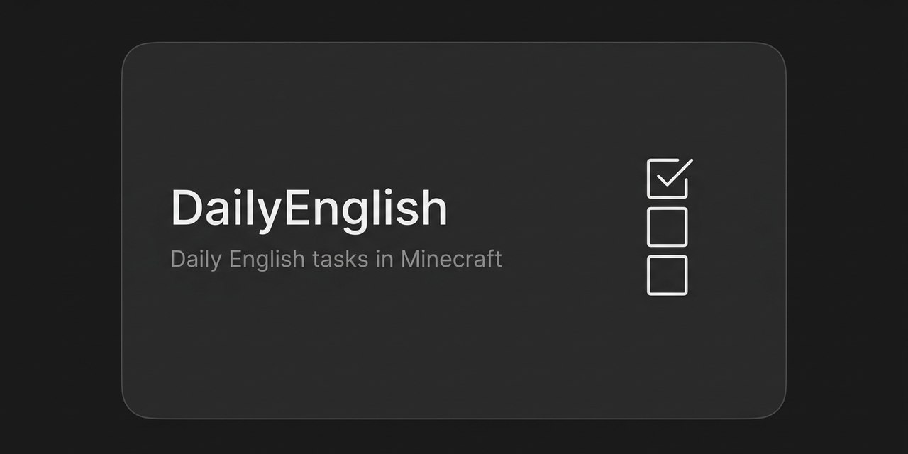

# DailyEnglish

[](LICENSE)
[](https://papermc.io/downloads/paper)
[](https://www.spigotmc.org/resources/vault.34315/)

Daily English tasks inside Minecraft. Each level has its own task pool
(craft a brewing stand, plant 32 carrots, collect 8 coal) split into easy,
medium, and hard difficulty. Players get their task list for the day, work
through it, and earn rewards.

<p align="center">
  
</p>

Part of a four-plugin ESL family: [Chat2Earn](https://github.com/itsfedor/chat2earn) · [EnglishProgression](https://github.com/itsfedor/englishprogression) · [VocabQuiz](https://github.com/itsfedor/vocabquiz) · [DailyEnglish](https://github.com/itsfedor/dailyenglish)

## Why this plugin exists

A student who logs in every day to do one small English task is learning.
The tasks double as gameplay goals, so the language practice is a side
effect of playing, not homework.

## Features

- Level-tuned task pools: A0 tasks teach basics, B1 tasks demand real recipes (conduits, respawn anchors, lodestone compasses)
- Task types: CRAFT, PLANT, COLLECT and more, each with a written English instruction
- Book GUI shows today's tasks in-game
- `/dailyenglish describe <taskId>` — write a short English description of your task and an AI check (Groq) accepts it or asks for more detail
- Rewards paid through Vault

## Requirements

- Paper or Spigot 1.21+
- [Vault](https://www.spigotmc.org/resources/vault.34315/) + an economy plugin (e.g. [EssentialsX](https://essentialsx.net/downloads.html))
- A Groq API key from [console.groq.com](https://console.groq.com) (free tier works) — required for the `describe` AI check
- Optional: [LuckPerms](https://luckperms.net/) for per-level task pools

## Commands

```
/tasks                        show your daily tasks
/dailyenglish answer <taskId> <index>   submit an answer
/dailyenglish describe <taskId>         describe the task in English (AI-checked)
```

## Install

1. Download `DailyEnglish.jar` from [Releases](https://github.com/itsfedor/dailyenglish/releases/latest) (or use the copy in the repo root).
2. Put the jar in `plugins/`.
3. Copy `config.example.yml` to `config.yml` and set your Groq key (`groq.api-key`).
4. Copy the `tasks/` folder next to `config.yml`.
5. Restart the server.

## Build from source

```bash
./gradlew build
```

Requires JDK 21. Produces `build/libs/DailyEnglish.jar`.

## Task files

Task pools live in `plugins/DailyEnglish/tasks/`, one file per level
(`tasks_a1.yml`, `tasks_b1.yml`, ...). Tasks are plain YAML entries:

```yaml
- {id: b1_craft_01, type: CRAFT, difficulty: MEDIUM,
   instruction: "Craft a brewing stand", target: BREWING_STAND}
```

The full task sets for every level ship in the `tasks/` folder of this repo.

## Troubleshooting

- **`/tasks` shows nothing** — make sure the `tasks/` folder was copied next to `config.yml`, with one YAML file per level (`tasks_a0.yml` …).
- **`describe` always fails or auto-accepts instantly** — the AI check needs a valid `groq.api-key` in `config.yml`; on an API error the plugin logs a warning and auto-accepts.
- **Rewards not paid** — a Vault-registered economy plugin must be installed; Vault by itself pays nothing.

## License

MIT. See [LICENSE](LICENSE).
